<h1 align="center">Hi 👋, I'm Master Laplace</h1>

- 👀 I’m interested in Computer Science, Network, Mathematics, Physics, Philosophy, and more.
- 🔭 I’m currently working 4 different projects that will be linked into one : [Engine-3D](https://github.com/MasterLaplace/Engine-3D), [Flakkari](https://github.com/MasterLaplace/Flakkari), [LplKernel](https://github.com/MasterLaplace/LplKernel), [LplPlugin](https://github.com/MasterLaplace/LplPlugin)
- 🌱 I’m currently learning too much
- 💞️ I’m currently collaborating on [EngineSquared](https://github.com/EngineSquared/EngineSquared)
- 📫 How to reach me, on Discord at _gigabird

  
  
  

---------------

**My favorite quote :**
> The owl of Minerva takes its flight only when the shades of night are gathering.

---------------

### Languages and Tools

---------------

## Featured Projects

- [Engine-3D](https://github.com/MasterLaplace/Engine-3D) - 3D rendering engine using rasterization in C with CSFML. Features real-time object rendering, camera controls, texture mapping, and z-buffer implementation.

- [Flakkari](https://github.com/MasterLaplace/Flakkari) - UDP/TCP multiplayer game server and client library with multi-threaded architecture, game state synchronization, and dynamic game loading from remote repositories.

- [LplKernel](https://github.com/MasterLaplace/LplKernel) - Custom operating system kernel implementing protected mode, paging, GDT/IDT, and interrupt handling with integrated VSCode debugging support.

- [LplPlugin](https://github.com/MasterLaplace/LplPlugin) - Low-latency real-time simulation engine using zero-copy architecture from NIC to GPU with ECS and CUDA physics kernels achieving sub-100μs kernel-to-userspace latency.

---------------

## Statistics

  
  

  

---------------

## Contributions & Highlights

  

---------------

## Trophy

  

---------------

<!---
MasterLaplace/MasterLaplace is a ✨ special ✨ repository because its `README.md` (this file) appears on your GitHub profile.
You can click the Preview link to take a look at your changes.
--->
